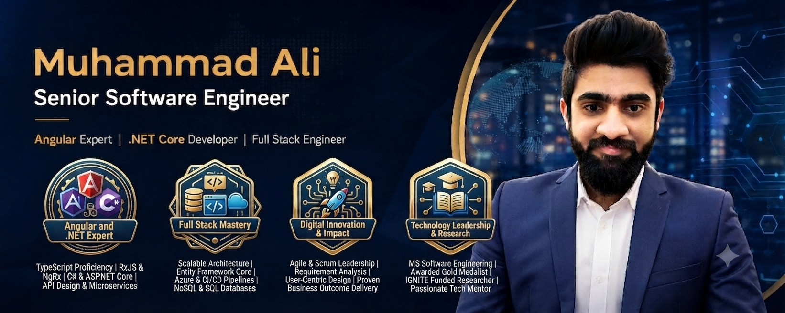

 

`Lahore, Pakistan` · `Senior Software Engineer` · `5+ Years Experience`

 

## About Me

I'm a Senior Full Stack Software Engineer with 5+ years of experience designing and building enterprise-grade applications on the **Angular + ASP.NET Core** stack. My work has been concentrated in domains where correctness and traceability matter — healthcare, insurance, compliance auditing, and research administration — building systems that automate workflows, enforce regulatory requirements, and hold up under real operational load.

I like software problems that involve more than writing code: modeling messy business rules cleanly, designing data structures that won't need a rewrite in a year, and keeping a system understandable as it grows past its first version. I care about clean architecture not as a buzzword but because I've had to maintain systems that didn't have one.

**Engineering philosophy:** favor clarity over cleverness, design for the maintainer who inherits the code, and treat tests and documentation as part of the deliverable — not an afterthought.

 

## Experience Snapshot

<table>
<tr>
<td align="center" width="20%"><b>5+</b> Years of Experience</td>
<td align="center" width="20%"><b>6+</b> Industries Served</td>
<td align="center" width="20%"><b>9+</b> Enterprise Systems Delivered</td>
<td align="center" width="20%"><b>Full Stack</b> Angular + .NET</td>
<td align="center" width="20%"><b>Mentor</b> Junior Developers</td>
</tr>
</table>

**Industries:** Healthcare · Insurance · Construction Compliance · Research Administration · Audit Management · Enterprise Resource Planning · Government Systems

 

## Current Focus

- 🏗️ Designing microservices-based enterprise systems with clean separation of concerns
- ☁️ Deepening hands-on experience with cloud-native deployment patterns (Azure, AWS)
- 🔍 Applying system design principles to legacy modernization projects
- 🤖 Exploring practical AI integration points in existing enterprise workflows
- 🧭 Growing into a technical leadership role — architecture decisions, code review standards, mentoring

 

## Tech Stack

**Frontend**

**Backend**

**Databases**

**Cloud & DevOps**

**Testing & Practice**

 

## Core Competencies

| Category | Focus Areas |
|---|---|
| **Architecture** | Clean Architecture, Microservices, Domain-Driven Design, CQRS |
| **API Design** | RESTful APIs, Authentication/Authorization, API versioning, SignalR real-time services |
| **Data** | Relational schema design, query optimization, Entity Framework performance tuning |
| **Quality** | SOLID principles, design patterns, code review standards, unit/integration testing |
| **Scale & Reliability** | Caching strategies, performance profiling, high-availability design |
| **Leadership** | Mentoring junior engineers, technical documentation, cross-team requirement gathering |

 

## Architecture & Engineering

<b>Expand — principles I apply in day-to-day system design</b>

 

- **SOLID principles** as a baseline, not a checklist — applied where they reduce coupling, skipped where they'd add ceremony
- **Repository & Unit of Work patterns** for testable, swappable data access layers
- **CQRS** for systems with meaningfully different read/write workloads (common in audit and reporting-heavy applications)
- **Dependency Injection** throughout, favoring composition over inheritance
- **Domain-Driven Design** concepts — bounded contexts, aggregates — applied pragmatically in complex business domains like claims and compliance workflows
- **Caching strategies** (in-memory and distributed) for read-heavy enterprise dashboards
- **Security-first design** — role-based authorization, input validation, and audit trails as first-class requirements in regulated domains

 

## Featured Projects

<table>
<tr>
<td width="50%" valign="top">

### 🏥 Healthcare Fraud Detection System
**Domain:** Healthcare · Insurance
**Stack:** Angular · ASP.NET Core · SQL Server
**Architecture:** Clean Architecture, layered services with rule-based validation engine
**Role:** Full Stack Developer
**Impact:** Automated claim-flagging rules that previously required manual review, reducing analyst triage time on flagged claims.

</td>
<td width="50%" valign="top">

### 📋 Case & Claim Management Platform
**Domain:** Insurance
**Stack:** Angular · ASP.NET Core Web API · SQL Server
**Architecture:** Modular REST API with role-based access control
**Role:** Full Stack Developer
**Impact:** Centralized case tracking across teams, replacing spreadsheet-based handoffs with a single system of record.

</td>
</tr>
<tr>
<td width="50%" valign="top">

### 🏗️ Construction Audit & Compliance System
**Domain:** Construction Compliance
**Stack:** Angular · ASP.NET Core · PostgreSQL
**Architecture:** Workflow engine with configurable audit checklists
**Role:** Full Stack Developer
**Impact:** Digitized paper-based audit workflows, giving compliance teams real-time visibility into audit status.

</td>
<td width="50%" valign="top">

### 🔬 Research Administration Platform
**Domain:** Research Administration
**Stack:** Angular · ASP.NET Core · SQL Server · SignalR
**Architecture:** Multi-tenant enterprise application with real-time notifications
**Role:** Full Stack Developer
**Impact:** Streamlined grant and research request approvals across multiple departments.

</td>
</tr>
<tr>
<td width="50%" valign="top">

### 📞 Insurance Customer Service Platform
**Domain:** Insurance
**Stack:** Angular · ASP.NET Core · REST APIs
**Architecture:** Service-oriented backend integrated with third-party insurance data providers
**Role:** Full Stack Developer
**Impact:** Reduced average customer service resolution time through a unified case view.

</td>
<td width="50%" valign="top">

### ⚙️ Enterprise Workflow & ERP Systems
**Domain:** Business Management · ERP
**Stack:** Angular · ASP.NET Core · MySQL
**Architecture:** Modular ERP components (Employee Management, Payroll) built on shared Clean Architecture core
**Role:** Full Stack Developer
**Impact:** Consolidated HR and payroll processes into one platform, cutting manual data entry across departments.

</td>
</tr>
</table>

 

## GitHub Statistics

 

 

<b>Contribution Snake</b>

 

Generated via <a href="https://github.com/Platane/snk">Platane/snk</a> GitHub Action.

 

## Achievements

| | |
|---|---|
| 🏅 **Gold Medalist** | MS Software Engineering |
| 🏆 **Employee of the Year** | Recognized for consistent delivery and technical ownership |
| ⭐ **Top Performer Award** | Awarded for measurable impact on delivery timelines |
| 🔬 **Best Researcher** | Recognized for research contribution during academic career |
| 💡 **IGNITE Funded Project** | Secured government funding for an academic technology project |
| 🎓 **Best Final Year Project** | Top-ranked capstone project in graduating class |
| 👥 **Mentor** | Ongoing mentorship of junior developers on architecture and code quality |

 

## Learning Roadmap

Currently deepening expertise in:

`Docker` → `Kubernetes` → `Redis` → `RabbitMQ` → `Kafka` → `Terraform` → `.NET Aspire` → `Cloud-Native Architecture` → `Applied AI Integration`

 

## Professional Interests

System Design · Cloud Architecture · Performance Engineering · DevOps · Applied AI · Open Source · Software Research

 

## Open Source Goals

I'm working toward contributing more consistently to open source — starting with small utility libraries drawn from patterns I've reused across enterprise projects (repository abstractions, API response wrappers, Angular form utilities), and eventually publishing starter templates for Clean Architecture in ASP.NET Core.

 

## Development Philosophy

> Code is read far more often than it's written — optimize for the next person, including future me.

- **Clean code** isn't about being clever; it's about being obvious
- **Maintainability** beats short-term speed almost every time
- **Tests** are part of the design process, not a step after it
- **Documentation** should explain *why*, since the code already explains *what*
- **Business value** is the actual measure of good engineering — not technology for its own sake

 

## Fun Facts

☕ Debugging sessions run on coffee and patience, in roughly equal measure
📚 Usually mid-way through a system design book or a research paper on distributed systems
🧑‍🏫 Enjoy explaining a hard concept until it clicks for someone else — that's often when it clicks better for me too
🧩 Treat every production bug as a small research problem worth documenting

 

## Connect With Me

  

 

*"Good architecture doesn't eliminate complexity — it gives complexity somewhere sensible to live."*

